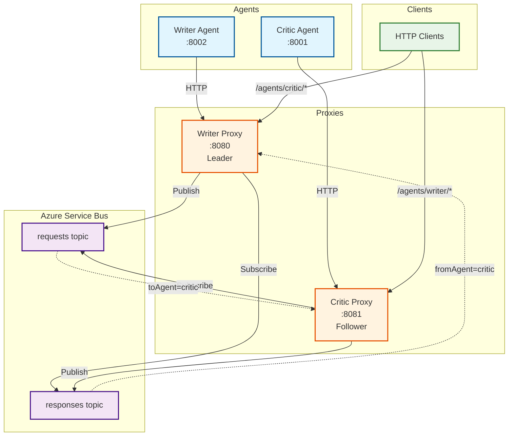

# A2A Service Bus Proxy

A Python-based proxy service that enables A2A (Agent-to-Agent) protocol communication over Azure Service Bus. The proxy transparently routes JSON-RPC requests and HTTP/2 Server-Sent Events (SSE) between distributed AI agents while maintaining protocol semantics.

## Quick Start: Running Two Proxy Instances

This guide shows how to run two proxy instances with different agent configurations - one hosting a "writer" agent (leader) and another hosting a "critic" agent (follower).

### Prerequisites

1. **Python 3.13** installed
2. **uv** package manager installed
3. **Azure Service Bus namespace** set up
4. **Two mock agents** running locally (writer on port 8002, critic on port 8001)

### Step 1: Install Dependencies

```bash
# Install dependencies
uv sync

# Verify installation
uv run python -c "import src.main; print('Installation successful')"
```

### Step 2: Configure Azure Service Bus

Create a Service Bus namespace in Azure and note the connection string. You'll need:
- Namespace name (e.g., `a2a-dev`)
- Connection string with manage permissions

### Step 3: Create Configuration Files

#### Writer Proxy Configuration (Leader)

Create `config/proxy-writer.yaml`:

```yaml
proxy:
  id: "proxy-writer"
  role: "coordinator"
  port: 8080

servicebus:
  namespace: "a2a-dev"
  connectionString: "Endpoint=sb://a2a-dev.servicebus.windows.net/;SharedAccessKeyName=RootManageSharedAccessKey;SharedAccessKey=YOUR_KEY_HERE"
  requestTopic: "requests"
  responseTopic: "responses"
  notificationTopic: "notifications"
  defaultMessageTtl: 3600
  maxRetryCount: 3
  receiveTimeout: 30

# This proxy hosts the writer agent
hostedAgents:
  blog-agents:
    - writer

# Subscribe to messages targeting the writer
subscriptions:
  - group: "blog-agents"
    filter: "toAgent = 'writer'"

limits:
  maxConcurrentStreams: 200
  maxMessageSize: 1048576
  streamBufferSize: 10485760
  queueDepthThreshold: 5000

monitoring:
  metricsPort: 9090
  healthPort: 8081
  logLevel: "info"

sessions:
  store_type: "file"
  file_store:
    base_directory: "./data/sessions-writer"
  default_ttl: 3600
  cleanup_interval: 300
  max_sessions: 10000
```

#### Critic Proxy Configuration (Follower)

Create `config/proxy-critic.yaml`:

```yaml
proxy:
  id: "proxy-critic"
  role: "follower"
  port: 8081

servicebus:
  namespace: "a2a-dev"
  connectionString: "Endpoint=sb://a2a-dev.servicebus.windows.net/;SharedAccessKeyName=RootManageSharedAccessKey;SharedAccessKey=YOUR_KEY_HERE"
  requestTopic: "requests"
  responseTopic: "responses"
  notificationTopic: "notifications"
  defaultMessageTtl: 3600
  maxRetryCount: 3
  receiveTimeout: 30

# This proxy hosts the critic agent
hostedAgents:
  blog-agents:
    - critic

# Subscribe to messages targeting the critic
subscriptions:
  - group: "blog-agents"
    filter: "toAgent = 'critic'"

limits:
  maxConcurrentStreams: 200
  maxMessageSize: 1048576
  streamBufferSize: 10485760
  queueDepthThreshold: 5000

monitoring:
  metricsPort: 9091  # Different port from writer
  healthPort: 8082   # Different port from writer
  logLevel: "info"

sessions:
  store_type: "file"
  file_store:
    base_directory: "./data/sessions-critic"
  default_ttl: 3600
  cleanup_interval: 300
  max_sessions: 10000
```

#### Agent Registry Configuration

Update `config/agent-registry.yaml`:

```yaml
version: "1.0"
lastUpdated: "2024-01-01T00:00:00Z"

groups:
  blog-agents:
    agents:
      - id: writer
        fqdn: localhost:8002
        proxyId: proxy-writer
        healthEndpoint: /health
        agentCardEndpoint: /.well-known/agent.json
        capabilities: ["message/send", "message/stream"]
        a2aCapabilities:
          streaming: true
          pushNotifications: false
          stateTransitionHistory: true
      - id: critic
        fqdn: localhost:8001
        proxyId: proxy-critic
        healthEndpoint: /health
        agentCardEndpoint: /.well-known/agent.json
        capabilities: ["message/send", "message/stream"]
        a2aCapabilities:
          streaming: true
          pushNotifications: true
          stateTransitionHistory: false
```

### Step 4: Start Mock Agents

In separate terminal windows, start your mock agents:

```bash
# Terminal 1 - Writer agent (port 8002)
python mock_agent.py --port 8002 --name writer

# Terminal 2 - Critic agent (port 8001)
python mock_agent.py --port 8001 --name critic
```

### Step 5: Start Proxy Instances

#### Start Writer Proxy (Leader)

```bash
# Terminal 3 - Writer proxy
CONFIG_PATH=config/proxy-writer.yaml uv run python -m src.main
```

The writer proxy will:
- Start as coordinator (leader role)
- Listen on port 8080
- Host the "writer" agent
- Subscribe to messages targeting the writer

#### Start Critic Proxy (Follower)

```bash
# Terminal 4 - Critic proxy
CONFIG_PATH=config/proxy-critic.yaml uv run python -m src.main
```

The critic proxy will:
- Start as follower
- Listen on port 8081
- Host the "critic" agent
- Subscribe to messages targeting the critic

### Step 6: Test the Setup

#### Test Writer → Critic Communication

```bash
# Send a message from writer to critic via writer proxy
curl -X POST http://localhost:8080/agents/critic/v1/messages:send \
  -H "Content-Type: application/json" \
  -H "From-Agent: writer" \
  -d '{
    "method": "review",
    "params": {
      "content": "This is a draft blog post about AI agents.",
      "criteria": ["clarity", "accuracy", "engagement"]
    },
    "id": "req-001"
  }'
```

#### Test Critic → Writer Communication

```bash
# Send a message from critic to writer via critic proxy
curl -X POST http://localhost:8081/agents/writer/v1/messages:send \
  -H "Content-Type: application/json" \
  -H "From-Agent: critic" \
  -d '{
    "method": "revise",
    "params": {
      "feedback": "Great content! Consider adding more examples.",
      "priority": "medium"
    },
    "id": "req-002"
  }'
```

### Step 7: Monitor the Proxies

#### Check Health Endpoints

```bash
# Writer proxy health
curl http://localhost:8081/health

# Critic proxy health
curl http://localhost:8082/health
```

#### Check Metrics

```bash
# Writer proxy metrics
curl http://localhost:9090/metrics

# Critic proxy metrics
curl http://localhost:9091/metrics
```

#### View Logs

Each proxy logs to its own file:
- Writer proxy: `./proxy-writer.log`
- Critic proxy: `./proxy-critic.log`

### Architecture Overview



### Key Configuration Differences

| Aspect | Writer Proxy (Leader) | Critic Proxy (Follower) |
|--------|----------------------|-------------------------|
| **Role** | `coordinator` | `follower` |
| **Port** | `8080` | `8081` |
| **Metrics Port** | `9090` | `9091` |
| **Health Port** | `8081` | `8082` |
| **Hosted Agent** | `writer` | `critic` |
| **Agent FQDN** | `localhost:8002` | `localhost:8001` |
| **Session Directory** | `./data/sessions-writer` | `./data/sessions-critic` |
| **Subscription Filter** | `toAgent = 'writer'` | `toAgent = 'critic'` |

### Message Flow Example

1. **Client → Writer Proxy**: `POST /agents/critic/v1/messages:send`
2. **Writer Proxy → Service Bus**: Message wrapped with `toAgent=critic`
3. **Service Bus → Critic Proxy**: Filtered by subscription `toAgent = 'critic'`
4. **Critic Proxy → Critic Agent**: Original HTTP request forwarded
5. **Critic Agent → Critic Proxy**: Response
6. **Critic Proxy → Service Bus**: Response with `fromAgent=critic`
7. **Service Bus → Writer Proxy**: Filtered by correlation ID
8. **Writer Proxy → Client**: Final response

### Troubleshooting

#### Common Issues

1. **Connection Refused**
   - Ensure agents are running on correct ports
   - Check firewall settings

2. **Service Bus Authentication**
   - Verify connection string is correct
   - Ensure Service Bus namespace exists

3. **Port Conflicts**
   - Make sure each proxy uses unique ports
   - Check that no other services use the same ports

4. **Message Routing**
   - Verify agent registry configuration
   - Check subscription filters in proxy configs

#### Debug Commands

```bash
# Test Service Bus connectivity
uv run python test_servicebus_simple.py

# Test routing
uv run python test_routing_simple.py

# Run end-to-end tests
./run_e2e_tests.sh
```

### Production Considerations

1. **Security**
   - Use Azure Managed Identity instead of connection strings
   - Implement proper authentication for agent endpoints
   - Use HTTPS for all communications

2. **Scaling**
   - Add more proxy instances as needed
   - Configure load balancing for high availability
   - Monitor message queue depths

3. **Monitoring**
   - Set up application insights
   - Configure alerting on health endpoints
   - Monitor Service Bus metrics

4. **Data Persistence**
   - Consider Redis for session storage in production
   - Implement database backups for critical data
   - Configure appropriate TTL values

### Next Steps

- Implement streaming (SSE) support for long-running conversations
- Add authentication and authorization
- Set up production monitoring and alerting
- Deploy to Azure Container Instances or App Service

### Testing Your Setup

Once you have both proxies running, you can test the configuration with the provided test script:

```bash
# Run the comprehensive test suite
uv run python test_two_proxy_setup.py
```

This test script will:
1. **Health Check**: Verify all services (proxies and agents) are responding
2. **Writer → Critic**: Test message routing from writer to critic via Service Bus
3. **Critic → Writer**: Test reverse message routing
4. **Bidirectional Conversation**: Test a multi-step conversation between agents

#### Manual Testing Commands

You can also test manually with curl commands:

```bash
# Test 1: Writer to Critic (via Writer Proxy)
curl -X POST http://localhost:8080/agents/critic/v1/messages:send \
  -H "Content-Type: application/json" \
  -H "From-Agent: writer" \
  -d '{
    "method": "review",
    "params": {
      "content": "This is a draft blog post about microservices architecture.",
      "criteria": ["technical_accuracy", "clarity", "completeness"]
    },
    "id": "manual-test-001"
  }'

# Test 2: Critic to Writer (via Critic Proxy)
curl -X POST http://localhost:8081/agents/writer/v1/messages:send \
  -H "Content-Type: application/json" \
  -H "From-Agent: critic" \
  -d '{
    "method": "revise",
    "params": {
      "feedback": "Good technical content! Consider adding more examples.",
      "priority": "medium",
      "suggestions": ["Add code examples", "Include diagrams", "Expand conclusion"]
    },
    "id": "manual-test-002"
  }'

# Test 3: Check proxy metrics
curl http://localhost:9090/metrics  # Writer proxy metrics
curl http://localhost:9091/metrics  # Critic proxy metrics
```

### Configuration Validation

Before starting the proxies, validate your configuration:

#### 1. Service Bus Connection

Test your Service Bus connection string:

```bash
# Test Service Bus connectivity
uv run python -c "
from azure.servicebus import ServiceBusClient
conn_str = 'YOUR_CONNECTION_STRING_HERE'
try:
    client = ServiceBusClient.from_connection_string(conn_str)
    print('✓ Service Bus connection successful')
except Exception as e:
    print(f'✗ Service Bus connection failed: {e}')
"
```

#### 2. Port Availability

Check that required ports are available:

```bash
# Check if ports are free (should return nothing if available)
netstat -an | grep :8080  # Writer proxy
netstat -an | grep :8081  # Critic proxy
netstat -an | grep :8001  # Critic agent
netstat -an | grep :8002  # Writer agent
netstat -an | grep :9090  # Writer metrics
netstat -an | grep :9091  # Critic metrics
```

#### 3. Configuration Validation Script

```bash
# Create a simple validation script
cat > validate_config.py << 'EOF'
import yaml
import sys

def validate_config(config_path):
    try:
        with open(config_path, 'r') as f:
            config = yaml.safe_load(f)
        
        # Check required sections
        required_sections = ['proxy', 'servicebus', 'hostedAgents']
        for section in required_sections:
            if section not in config:
                print(f"✗ Missing required section: {section}")
                return False
        
        # Check Service Bus connection string
        if 'YOUR_KEY_HERE' in config['servicebus'].get('connectionString', ''):
            print(f"✗ Please update Service Bus connection string in {config_path}")
            return False
        
        print(f"✓ Configuration {config_path} is valid")
        return True
        
    except Exception as e:
        print(f"✗ Error validating {config_path}: {e}")
        return False

# Validate both configs
writer_valid = validate_config('config/proxy-writer.yaml')
critic_valid = validate_config('config/proxy-critic.yaml')

if writer_valid and critic_valid:
    print("✓ All configurations are valid")
    sys.exit(0)
else:
    print("✗ Configuration validation failed")
    sys.exit(1)
EOF

# Run validation
uv run python validate_config.py
```

## Simple Usage

For quick testing or development, you can use the simple runner scripts:

### Linux/Mac
```bash
# Run with any config file
./run-proxy.sh config/proxy-writer.yaml
./run-proxy.sh config/proxy-critic.yaml

# See available config files
./run-proxy.sh
```

### Windows
```cmd
# Run with any config file
run-proxy.bat config\proxy-writer.yaml
run-proxy.bat config\proxy-critic.yaml

# See available config files
run-proxy.bat
```

These scripts will:
- Validate the config file exists
- Extract proxy information (ID, port, role)
- Create necessary directories
- Set up logging
- Start the proxy with the specified configuration