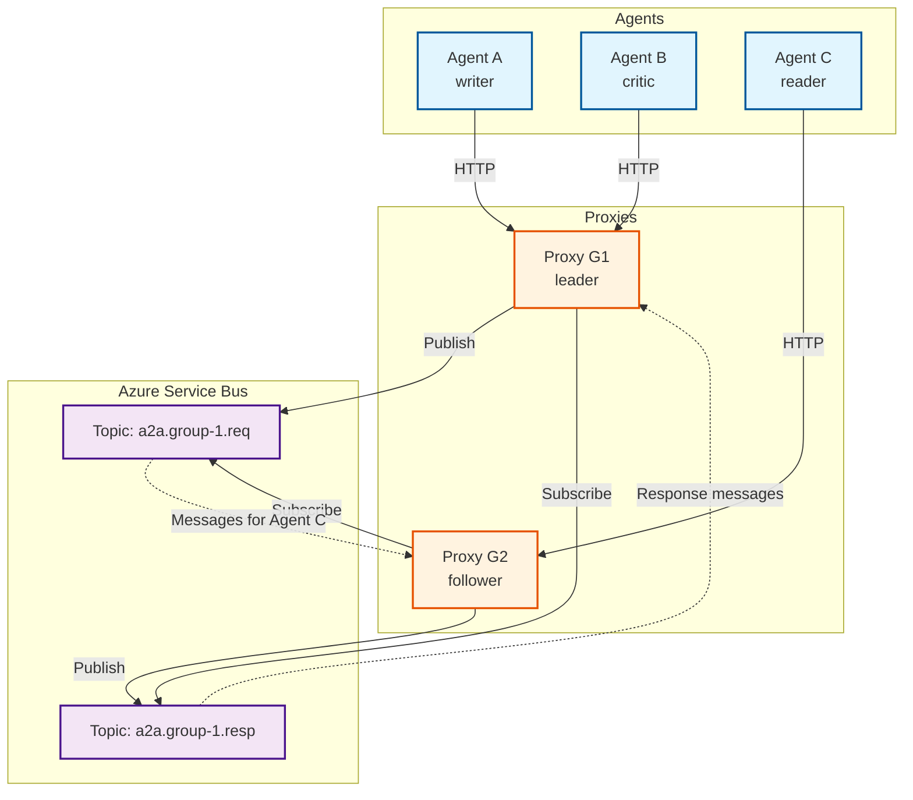
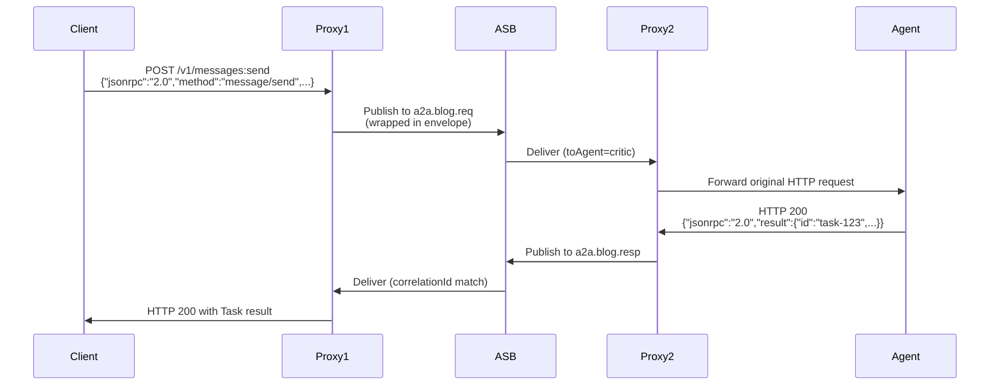
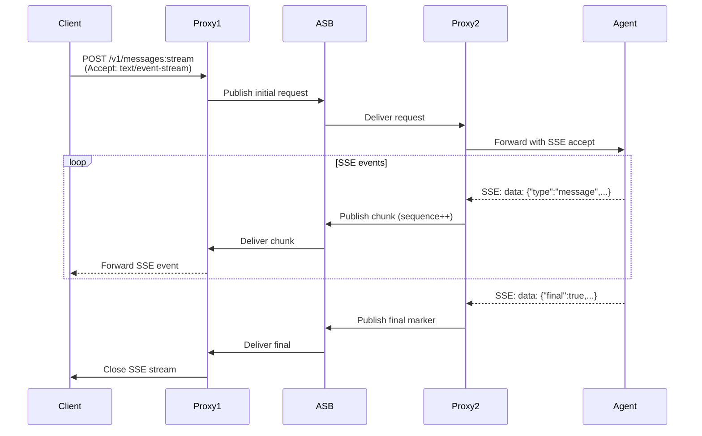

# A2A Service-Bus Proxy Specification

## 1. Purpose
Provide transparent, reliable, and scalable transport of A2A (JSON-RPC + HTTP/2 SSE) traffic between LLM agents through Azure Service Bus (ASB).  
Agents remain unaware of the proxy layer.

## 2. Goals
- Zero-code change for agents (keep original A2A endpoints and contract)
- Support request/response and long-running SSE streams
- Horizontal scaling via proxy groups
- Single proxy instance may serve multiple *agent groups* (multi-tenant)
- Fine-grained routing by *agent group* (multi-tenant isolation)
- Ordered, at-least-once delivery with correlation and back-pressure handling
- Centralized configuration distribution and health monitoring
- Preserve A2A protocol semantics including Agent Cards, task lifecycle, and authentication

## 3. High-Level Architecture


*Any proxy* can accept inbound HTTP/2 calls; messages are forwarded over ASB to the proxy hosting the destination agent.  
**Each agent has exactly one instance** connected to exactly one proxy in the network.

## 4. Service Bus Entity Model
| Entity                 | Type   | Purpose                                   |
|------------------------|--------|-------------------------------------------|
| `a2a.<group>.req`      | Topic  | All outbound JSON-RPC requests            |
| `a2a.<group>.resp`     | Topic  | All JSON-RPC responses / SSE chunks       |
| `proxy.<proxyId>.cfg`  | Queue  | Leader → followers configuration multicast|
| `health.beat`          | Topic  | Liveness/metrics events                   |
| `a2a.<group>.dlq`      | Queue  | Dead-letter queue for undeliverable msgs  |

Subscriptions are auto-filtered by `toAgent`, `fromAgent`, and `correlationId` to limit fan-out.  
*A proxy may hold multiple subscriptions (one per group) if it bridges several agent-groups.*

### Subscription Rules
```sql
-- Request subscription for proxy hosting 'critic' agent
toAgent = 'critic' AND group = 'blog-agents'

-- Response subscription for originating proxy
correlationId = '<specific-correlation-id>' AND fromAgent = 'critic'
```

## 5. Message Envelope
```jsonc
{
  "protocol": "a2a-jsonrpc-sse/1.0",
  "group": "blog-agents",
  "toAgent": "critic",
  "fromAgent": "writer",
  "correlationId": "uuid-v4",
  "isStream": true,
  "sequence": 0,          // Increment for SSE chunks
  "timestamp": 1704067200000,
  "ttl": 300000,          // Message TTL in ms
  "headers": {            // Original HTTP headers
    "Authorization": "Bearer ...",
    "X-Request-ID": "...",
    "Accept": "text/event-stream"
  },
  "httpPath": "/v1/messages:send",  // Original HTTP path for routing
  "payload": { /* original JSON-RPC message */ }
}
```

### SSE Stream Envelope Extension
```jsonc
{
  // ...base envelope fields...
  "streamMetadata": {
    "streamId": "uuid-v4",
    "chunkType": "data|event|error|end",
    "eventName": "message",  // SSE event name
    "retry": 1000,           // SSE retry hint
    "lastEventId": "123",    // SSE last event ID
    "final": true            // Indicates terminal event
  }
}
```

## 6. Request / Response Flow

### 6.1 A2A Method to HTTP Endpoint Mapping
The proxy preserves the A2A protocol's HTTP endpoint conventions:

| JSON-RPC Method | HTTP Path | Description |
|-----------------|-----------|-------------|
| `message/send` | `/v1/messages:send` | Send message (sync) |
| `message/stream` | `/v1/messages:stream` | Send message (SSE) |
| `tasks/get` | `/v1/tasks:get` | Get task status |
| `tasks/cancel` | `/v1/tasks:cancel` | Cancel task |
| `tasks/pushNotificationConfig/set` | `/v1/tasks/pushNotificationConfig:set` | Configure webhooks |
| `tasks/pushNotificationConfig/get` | `/v1/tasks/pushNotificationConfig:get` | Get webhook config |
| `tasks/resubscribe` | `/v1/tasks:resubscribe` | Reconnect to SSE |

### 6.2 Simple Request-Response (message/send)


### 6.3 SSE Stream Flow (message/stream)


## 7. Proxy Coordination (Static Leader)

### 7.1 Agent Registry with A2A Extensions
```yaml
version: "1.0"
lastUpdated: "2024-01-01T00:00:00Z"
groups:
  blog-agents:
    agents:
      - id: writer
        fqdn: writer.local:8002
        proxyId: proxy-west-1  # Which proxy hosts this agent
        healthEndpoint: /health
        agentCardEndpoint: /.well-known/agent.json  # A2A discovery
        capabilities: ["message/send", "message/stream"]
        a2aCapabilities:
          streaming: true
          pushNotifications: false
          stateTransitionHistory: true
      - id: critic
        fqdn: critic.local:8001
        proxyId: proxy-west-2  # Different proxy for load distribution
        healthEndpoint: /health
        agentCardEndpoint: /.well-known/agent.json
        capabilities: ["message/send", "message/stream"]
        a2aCapabilities:
          streaming: true
          pushNotifications: true
          stateTransitionHistory: false
  research-agents:
    agents:
      - id: researcher
        fqdn: researcher.local:8003
        proxyId: proxy-east-1
        healthEndpoint: /health
        agentCardEndpoint: /.well-known/agent.json
        capabilities: ["message/send", "search"]
```

### 7.2 Agent Card Proxying
The proxy serves Agent Cards from agent-specific paths, maintaining the A2A discovery pattern:

```jsonc
// When client requests: http://proxy:8080/agents/critic/.well-known/agent.json
// Proxy fetches from: http://critic.local:8001/.well-known/agent.json

// Original Agent Card from critic.local:8001
{
  "name": "Critic Agent",
  "url": "http://critic.local:8001",
  "description": "Reviews and critiques content",
  "version": "1.0.0"
}

// Proxy returns rewritten Agent Card
{
  "name": "Critic Agent", 
  "url": "http://proxy:8080/agents/critic",  // Rewritten to proxy URL with agent prefix
  "description": "Reviews and critiques content",
  "version": "1.0.0"
}
```

### 7.3 URL Routing Pattern
The proxy uses path-based routing to identify target agents:

| Client Request | Proxy Action | Forward To |
|----------------|--------------|------------|
| `GET /agents/critic/.well-known/agent.json` | Fetch agent card | `http://critic.local:8001/.well-known/agent.json` |
| `POST /agents/critic/v1/messages:send` | Route message | `http://critic.local:8001/v1/messages:send` |
| `POST /agents/critic/v1/messages:stream` | Route stream | `http://critic.local:8001/v1/messages:stream` |
| `GET /agents/critic/v1/tasks:get?id=123` | Route query | `http://critic.local:8001/v1/tasks:get?id=123` |

The proxy extracts the agent ID from the URL path (`/agents/{agent-id}/*`) and uses it for routing decisions.

## 8. A2A Protocol Preservation

### 8.1 Task Lifecycle Management
The proxy maintains task state consistency across Service Bus transport:
- Preserves `contextId` for conversation grouping
- Maintains `correlationId` mapping to A2A task IDs
- Handles task state transitions (submitted → working → completed/failed)
- Supports `tasks/cancel` across distributed agents

### 8.2 Artifact Handling
For file artifacts referenced in A2A messages:
- Proxy does NOT transfer file content through Service Bus
- File URIs remain pointing to original agent endpoints
- Proxy can optionally rewrite URIs for security/routing
- Large artifacts use direct agent-to-agent transfer

### 8.3 Authentication Passthrough
```yaml
securityHandling:
  mode: "passthrough"  # passthrough | terminate | hybrid
  schemes:
    bearer:
      forward: true
      validateJwks: false  # Proxy doesn't validate, just forwards
    apiKey:
      forward: true
      headerName: "X-API-Key"
```

## 9. Security
- mTLS between agent ↔ proxy (internal network)
- ASB SAS policy per group (`Send`/`Listen` separation)
- JWT bearer passthrough possible; auth headers serialized in envelope
- Optional message encryption for sensitive payloads
- Audit logging for compliance
- **A2A Authentication Schemes:** Support for Bearer JWT, API Keys, OAuth as defined in Agent Cards
- **JWKS Endpoint Proxying:** Optional proxying of `/.well-known/jwks.json` for JWT validation
- **Push Notification Security:** Validate webhook URLs before forwarding to prevent SSRF

### SAS Policy Configuration
```yaml
policies:
  blog-agents-send:
    rights: ["Send"]
    topics: ["a2a.blog-agents.req", "a2a.blog-agents.resp"]
  blog-agents-listen:
    rights: ["Listen"]
    topics: ["a2a.blog-agents.req", "a2a.blog-agents.resp"]
```

## 10. Reliability & Ordering
- `sessionId = correlationId` guarantees in-order delivery per conversation
- Proxy stores incomplete SSE streams in an in-memory buffer with expiry
- Idempotent re-publishing based on `(correlationId, sequence)` de-dupes retries
- Configurable retry policies with exponential backoff
- Circuit breaker per destination agent
- **Single Agent Instance:** No need for load balancing or failover between agent instances
- **Task Deduplication:** Use A2A task IDs to prevent duplicate processing
- **Artifact Consistency:** Ensure artifact references remain valid across retries
- **Context Preservation:** Maintain `contextId` association across failures

### Stream State Management
```jsonc
{
  "streamId": "uuid",
  "correlationId": "uuid",
  "state": "active|paused|completed|failed",
  "chunks": [
    { "sequence": 0, "timestamp": 1704067200000, "data": "..." },
    { "sequence": 1, "timestamp": 1704067201000, "data": "..." }
  ],
  "lastActivity": 1704067201000,
  "ttl": 300000
}
```

## 11. Back-Pressure & Flow Control
- Proxy exposes `/metrics` with queue depth / lag
- When queue length > *threshold* send `503 Retry-After` to callers
- Optional *credit-based* flow: include `maxInFlight` header in config
- Adaptive rate limiting based on downstream agent response times
- Configurable buffer sizes per agent group
- **A2A Rate Limiting**
```http
X-RateLimit-Limit: 100
X-RateLimit-Remaining: 45
X-RateLimit-Reset: 1704067500
X-A2A-Task-Queue-Depth: 50
X-A2A-Active-Contexts: 25
```

## 12. Scaling Guidelines
- One proxy instance handles ~200 concurrent SSE streams (~8 vCPU)
- Scale out by adding more proxies and distributing agents across them
- Use *partitioned* topics for >10 k msg/s workloads
- Configure connection pooling: 100 AMQP connections per proxy
- Memory requirement: 4GB base + 10MB per concurrent stream
- **Agent Distribution:** Spread agents across proxies for optimal resource utilization

### Performance Tuning
```yaml
performance:
  connectionPool:
    minSize: 10
    maxSize: 100
    idleTimeout: 300s
  buffers:
    streamBuffer: 10MB
    messageBuffer: 1MB
  timeouts:
    agentConnect: 5s
    agentRequest: 30s
    streamIdle: 300s
```

## 13. Error Handling
| Error                    | Action                                   | Metric | A2A Error Code |
|--------------------------|------------------------------------------|--------|----------------|
| ASB publish failure      | Exponential retry (5 ×, jitter)          | `asb.publish.failed` | -32603 |
| Agent timeout            | Cancel outstanding envelope, propagate 504| `agent.timeout` | -32603 |
| Stream chunk lost        | Sender retries with same `sequence`      | `stream.chunk.retry` | N/A |
| Agent unavailable        | Return error (no failover available)     | `agent.unavailable` | -32603 |
| Invalid message format   | Log, drop, increment counter             | `message.invalid` | -32600 |
| Task not found          | Return A2A error response                | `task.notfound` | -32001 |
| Unsupported operation   | Return A2A error response                | `operation.unsupported` | -32004 |

### 13.1 A2A Error Response Example
```jsonc
{
  "jsonrpc": "2.0",
  "error": {
    "code": -32001,
    "message": "Task not found",
    "data": {
      "taskId": "task-123",
      "suggestion": "Task may have expired or been canceled"
    }
  },
  "id": "req-456"
}
```

## 14. Monitoring & Observability

### 14.1 A2A Specific Metrics
- `a2a.task.count{agent,group,state}`
- `a2a.context.active{agent,group}`
- `a2a.stream.duration{agent,group,percentile}`
- `a2a.artifact.size{agent,group,percentile}`
- `a2a.auth.failures{agent,scheme}`

### Health Check Endpoint
```http
GET /health
{
  "status": "healthy",
  "version": "1.0.0",
  "role": "follower",
  "configVersion": "2024-01-01-001",
  "uptime": 3600,
  "connections": {
    "asb": "connected",
    "agents": {
      "writer": "healthy",
      "critic": "degraded"
    }
  }
}
```

## 15. Deployment Patterns

### 15.1 Kubernetes Deployment
```yaml
apiVersion: apps/v1
kind: Deployment
metadata:
  name: a2a-proxy
spec:
  replicas: 3
  template:
    spec:
      containers:
      - name: proxy
        image: a2a/proxy:1.0
        env:
        - name: ROLE
          value: "follower"  # One pod should be "coordinator"
        - name: ASB_CONNECTION_STRING
          valueFrom:
            secretKeyRef:
              name: asb-secret
              key: connection-string
```

### 15.2 Azure Container Instances
```bash
az container create \
  --name a2a-proxy-1 \
  --image a2a/proxy:1.0 \
  --environment-variables \
    ROLE=coordinator \
    ASB_NAMESPACE=myasb \
  --secure-environment-variables \
    ASB_CONNECTION_STRING="$CONNECTION_STRING"
```

## 16. Future Enhancements
- gRPC transport option
- Per-agent traffic shaping
- Dead-letter queue for poison messages
- Prometheus exporter
- WebSocket transport for browser-based agents
- Message compression for large payloads
- Distributed tracing integration (OpenTelemetry)
- Multi-region active-active deployment
- Automatic agent discovery via service mesh
- **Agent Migration:** Support for moving agents between proxies with minimal downtime
- **A2A Protocol v2 Support:** Prepare for future protocol versions
- **Agent Capability Negotiation:** Dynamic capability discovery
- **Federated Agent Networks:** Cross-organization agent communication

---

## Appendix A: Configuration Example

```yaml
proxy:
  id: "proxy-west-1"
  role: "follower"
  port: 8080
  
servicebus:
  namespace: "a2a-asb-prod"
  connectionString: "${ASB_CONNECTION_STRING}"
  
# This proxy hosts these specific agents
hostedAgents:
  blog-agents:
    - writer  # Only one writer agent in the entire network
  research-agents:
    - researcher  # Only one researcher agent in the entire network
    
# This proxy subscribes to messages for its hosted agents
subscriptions:
  - group: "blog-agents"
    filter: "toAgent = 'writer'"  # Only messages destined for writer
  - group: "research-agents"
    filter: "toAgent = 'researcher'"  # Only messages destined for researcher
      
limits:
  maxConcurrentStreams: 200
  maxMessageSize: 1MB
  streamBufferSize: 10MB
  queueDepthThreshold: 5000
  
monitoring:
  metricsPort: 9090
  healthPort: 8081
  logLevel: "info"
```

## Appendix B: A2A Client Usage Examples

### B.1 Agent Discovery and Communication
```python
# Writer agent discovers critic agent through proxy
import httpx

async with httpx.AsyncClient() as client:
    # 1. Discover critic agent capabilities
    agent_card_response = await client.get(
        "http://proxy:8080/agents/critic/.well-known/agent.json"
    )
    agent_card = agent_card_response.json()
    
    # agent_card["url"] will be "http://proxy:8080/agents/critic"
    critic_url = agent_card["url"]
    
    # 2. Send message to critic agent
    response = await client.post(
        f"{critic_url}/v1/messages:send",  # Results in http://proxy:8080/agents/critic/v1/messages:send
        json={
            "jsonrpc": "2.0",
            "method": "message/send",
            "params": {
                "message": {
                    "role": "user",
                    "parts": [{
                        "type": "text",
                        "text": "Please review this blog post about AI agents"
                    }],
                    "contextId": "review-session-456"
                }
            },
            "id": "req-001"
        }
    )
    
    result = response.json()
    task_id = result["result"]["id"]
    print(f"Review task created: {task_id}")
```

### B.2 Configuration Example for Writer Agent
```yaml
# Writer agent configuration
critic_agent_url: "http://proxy:8080/agents/critic"  # Proxy URL with agent prefix
researcher_agent_url: "http://proxy:8080/agents/researcher"

# The writer will automatically discover capabilities by fetching:
# - http://proxy:8080/agents/critic/.well-known/agent.json
# - http://proxy:8080/agents/researcher/.well-known/agent.json
```

---

## Appendix C: Service Bus Message Examples

### C.1 Wrapped A2A Request
```jsonc
// ASB Message Properties
{
  "MessageId": "msg-789",
  "CorrelationId": "req-001",
  "SessionId": "req-001",  // For ordering
  "UserProperties": {
    "toAgent": "critic",
    "fromAgent": "writer",
    "group": "blog-agents"
  }
}

// ASB Message Body
{
  "protocol": "a2a-jsonrpc-sse/1.0",
  "group": "blog-agents",
  "toAgent": "critic",
  "fromAgent": "writer",
  "correlationId": "req-001",
  "isStream": false,
  "sequence": 0,
  "timestamp": 1704067200000,
  "ttl": 300000,
  "headers": {
    "Authorization": "Bearer eyJ...",
    "Content-Type": "application/json",
    "X-Request-ID": "client-req-456"
  },
  "httpPath": "/v1/messages:send",
  "payload": {
    "jsonrpc": "2.0",
    "method": "message/send",
    "params": {
      "message": {
        "role": "user",
        "parts": [{
          "type": "text",
          "text": "Review this blog post"
        }]
      }
    },
    "id": "req-001"
  }
}
```

---
    "params": {
      "message": {
        "role": "user",
        "parts": [{
          "type": "text",
          "text": "Review this blog post"
        }]
      }
    },
    "id": "req-001"
  }
}
```

---
